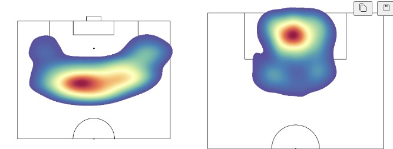
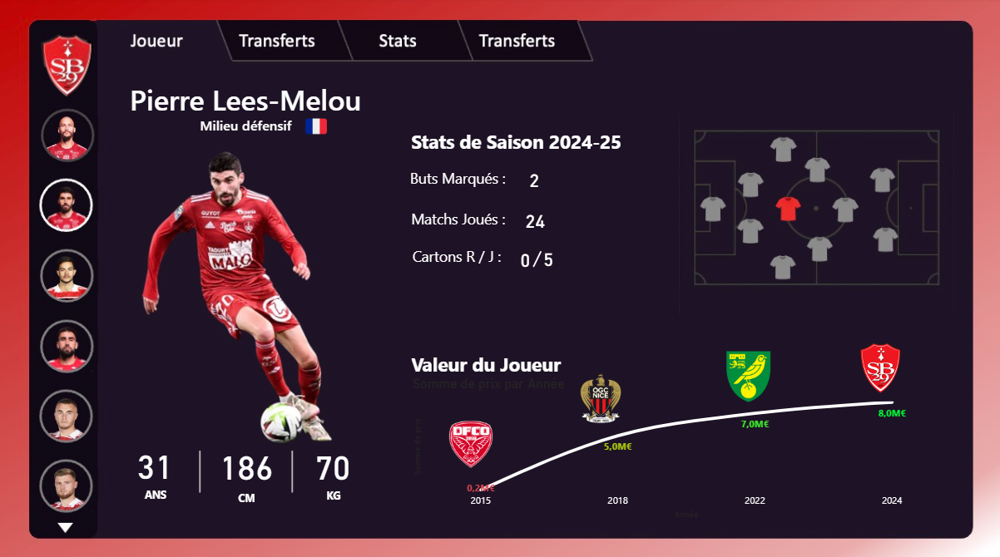

# Dashboard foot SB29

Dashboard Power BI et visualisations de donnees pour le Stade Brestois 29.

L'objectif : creer un reporting visuel propre et rapide a partir des donnees Transfermarkt, sans y passer trop de temps. Le projet permet de visualiser les stats des joueurs du club (poste, age, taille, matchs joues, buts marques, valeur marchande) et d'explorer quelques visualisations avancees comme les heatmaps de tirs.

  

<em>Apercu du dashboard Power BI - Ludovic Ajorque</em>

## Contenu

- **foot.pbix** : Dashboard Power BI avec les stats des joueurs
- **donnees_et_indicateurs.ipynb** : Notebook Python pour le nettoyage des donnees et les visualisations
- **data/** : Donnees joueurs et valuations

## Outils

- **Python / Pandas** : manipulation et nettoyage des donnees
- **Matplotlib / Seaborn** : visualisations et heatmaps
- **Power BI** : creation du dashboard interactif

## Donnees

Les donnees proviennent du dataset [Player Scores](https://www.kaggle.com/datasets/davidcariboo/player-scores) sur Kaggle, issu de Transfermarkt. Il contient les informations sur les joueurs, leurs stats et l'historique de leur valeur marchande.

Fichiers inclus dans le repo :
- [data/players.csv](data/players.csv) : informations joueurs
- [data/player_valuations.csv](data/player_valuations.csv) : historique des valuations

## Visualisations

En plus du dashboard Power BI, le notebook contient des analyses sur les tirs (corners, coups francs) avec des heatmaps pour visualiser les zones de frappe.

  

<em>Heatmap des corners et coups francs des joueurs du SB29</em>

  

<em>Apercu du dashboard - Pierre Lees-Melou</em>

